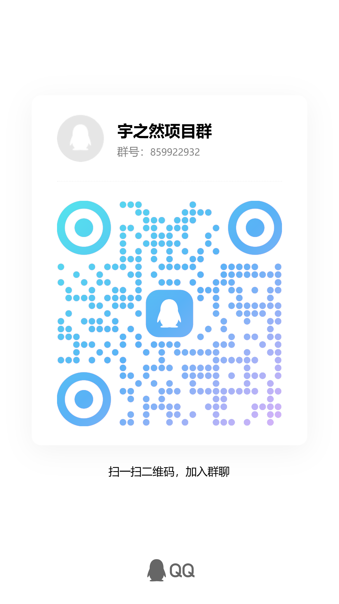

# 多境 (MultiScene)

> 写一次，发所有平台 — AI 多平台内容适配工具
>
> 开源 · BYOK 自部署 · 自由使用

## 🚀 快速开始

```bash
npm install
npm run dev    # http://localhost:5174
```

## 🔧 配置

在 `.env` 中设置你的 AI API（支持 OpenAI 兼容接口）：

```
VITE_API_BASE_URL=http://localhost:8100/v1
VITE_API_KEY=sk-yzr-...
```

## ✨ 功能

- 输入源内容 → AI 适配到 Twitter、LinkedIn、微信、小红书等平台
- 5 种语气风格（专业/朋友/故事/教育/促销）
- 中英文双语生成
- 单独重新生成单个平台内容
- 导出全部为 Markdown

## 📄 许可证

MIT

## 📮 加入社区



遇到问题、功能建议、交流开发经验，欢迎加入 QQ 群：

[点击链接加入群聊【宇之然项目群】](https://qm.qq.com/q/yQz5a8KL2U)

群号：搜索「宇之然项目群」直达
